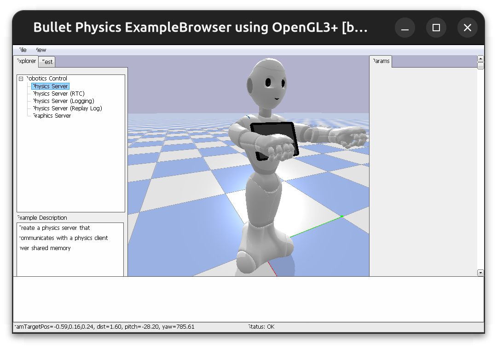

# PepperBox

PepperBox is a containerised gateway to the Pepper robot, wrapping legacy Python 2 NAOqi dependencies behind a modern HTTP and ZMQ API so researchers can deploy reproducibly and build applications for Pepper in modern Python 3.

PepperBox bundles the `qibullet` simulator, so you can develop without a physical Pepper and run automated experiments headlessly.

Switch between modes by setting `NAOQI_IP` and `NAOQI_PORT` in your environment before launching `./run.sh`:

- **Robot** `NAOQI_IP=<robot.ip>` and `NAOQI_PORT=9559` runs the Python 2 `pynaoqi` bridge.
- **Simulation** `NAOQI_IP=127.0.0.1` (or unset) runs the Python 3 `qiBullet` simulator.

The client is agnostic to whether you connect to a physical or simulated robot. In both cases a Flask **shim server** on port 5000 exposes a unified HTTP API to your Python 3 client code (see [`py3-naoqi-bridge/README.md`](py3-naoqi-bridge/README.md) for the wire contract and `NaoqiClient` reference).

## What's in the image

qiBullet, a Python 2.7 runtime, the bridge code (`py3-naoqi-bridge/`), and the simulation shim (`src/`). 

The pynaoqi SDK (SoftBank intellectual property) is not bundled in the image. A setup script fetches it on your behalf when you run it, so any licence acceptance sits with the user; see [Physical robot setup](#physical-robot-setup) below.


## Prerequisites

- Linux host
- Docker 
- For physical-robot use: a Pepper or NAO (NAO is untested) on a network reachable from the host

## Simulation

```bash
./run.sh
```

With `NAOQI_IP` unset or `127.0.0.1`, qiBullet starts. On first run, qiBullet's installer needs to write SoftBank-licensed Pepper URDF and mesh assets to `~/.qibullet`. To acknowledge the licence (a one-time step), set:

```bash
export PEPPERBOX_ACCEPT_SOFTBANK_LICENSE=1
./run.sh
```

Of course, first read the relevant licence files that ship with the qiBullet package before agreeing; see the project at `softbankrobotics-research/qibullet`.

By default the sim runs in headless. For the sim GUI window, set `QIBULLET_GUI=true` before launching:

```bash
export QIBULLET_GUI=true
./run.sh
```



## Usage

Install the Python 3 client into whatever environment your application runs in:

```bash
pip install -e py3-naoqi-bridge
```

Then talk to the shim exactly as you would talk to NAOqi directly:

```python
from naoqi_proxy import NaoqiClient

client = NaoqiClient()  # defaults to localhost:5000
client.ALTextToSpeech.say("Hello from Python 3!")
position = client.ALMotion.getRobotPosition(True)
```
See the [NAOqi 2.5 module reference](http://doc.aldebaran.com/2-5/naoqi/index.html).

Any `module.method(*args, **kwargs)` call you would make through `ALProxy` works through our `NaoqiClient`.

### Low latency streams

We ship two ZMQ subscribers alongside the client for low-latency data streaming:

- `clients.vision_client.VisionClient`: greyscale QVGA video on port `5559` (currently physical only).
- `clients.state_client.StateClient`: head joints (full body on the roadmap) at 50 Hz on port `5560`, with time-interpolated lookup (both robot and sim).

## Physical robot setup

You will need to install the SoftBank Robotics pynaoqi SDK once. PepperBox cannot ship it for legal reasons, but our `setup.sh` script fetches it directly from Aldebaran's CDN for you, with a Wayback Machine fallback, and verifies the SHA256. 

Simply run the command from the repository's root.

```bash
./setup.sh
```

This places the SDK at `~/.pepperbox/pynaoqi-python2.7-2.5.7.1-linux64/`. `run.sh` then bind-mounts that directory into the container at `/opt/pynaoqi-python2.7-2.5.7.1-linux64`.

Once you run the setup script, set the robot's address and run:

```bash
export NAOQI_IP=192.168.123.50   # your robot's IP
export NAOQI_PORT=9559
./run.sh
```

`entrypoint.sh` checks that the SDK is mounted and the robot is reachable before starting the bridge. If there's an issue, an error will inform you. 


## Architecture

```
PepperBox/
├── Dockerfile
├── entrypoint.sh           # mode dispatch + pre-flight checks
├── run.sh                  # standalone host launcher
├── setup.sh                # one-shot pynaoqi installer
├── src/                    # qiBullet (sim) backend
│   ├── shim_server.py      # Flask route + create_app factory
│   ├── dispatcher.py       # per-module dispatch returning (result, is_stub)
│   ├── driver.py           # QiBulletDriver sim lifecycle
│   ├── post_tasks.py       # TaskRegistry for NAOqi post() async dispatch
│   ├── adapters/           # per-module NAOqi adapters (motion, memory, ...)
│   └── setup_wizard.py     # qiBullet asset installer
└── py3-naoqi-bridge/        # pynaoqi (physical) backend + shared Python 3 client
    ├── shim_server.py       # pynaoqi (physical) shim
    ├── naoqi_proxy.py       # NaoqiClient — used against both shims
    ├── video_streamer.py
    └── ...                  # NAOqi-side services and clients
```

## Develop

`run.sh` bind-mounts `src/` and `py3-naoqi-bridge/` from the host into the container, so edits to Python sources are picked up on the next `./run.sh` without a rebuild. Rebuild the image only when the Dockerfile or its system dependencies change:

```bash
docker build -t ghcr.io/action-prediction-lab/pepper-box:latest .
```

> Rebuilding overwrites the upstream image in your local Docker cache, so subsequent `./run.sh` runs use your build.

## Contributing

Fork the repository, make your changes on a branch, and open a pull request against `main`. Match the surrounding code style; we don't enforce a formal one. Before opening the PR, test your changes in sim, or better, on the robot. In the PR description, include the expected behaviour and the steps reviewers can use to validate your contribution.

The CI pipeline builds the Dockerfile on each PR to confirm the image still assembles, and every PR is reviewed by the repository maintainers.

First-time contributors are encouraged to keep an eye out for open issues they can contribute to, and to submit new issues for bugs they hit or features they would like to see.

## Licence

This project is licensed under the Apache License 2.0 (see [LICENSE](LICENSE)).
